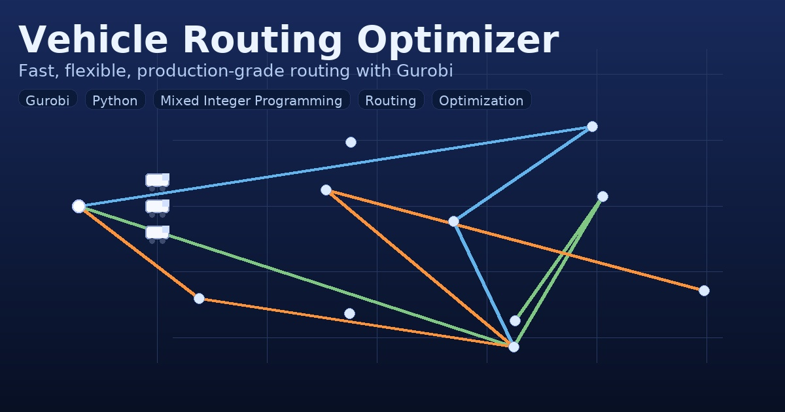

# Vehicle Routing Optimizer

Production-grade VRP pipeline for daily dispatch planning with **Gurobi**.  
Supports warm starts across phases, rate-card constraints, time windows, and flexible quantities.



## Why this project

Planners need fast, reliable routing that respects business rules: maximum stops, route duration, capacity and weight limits from **rate cards**, per-location and per-product **flex** windows, and delivery **time windows**. This repository turns CSV inputs into optimal, auditable routes and exports planner-friendly reports.

## Features

* Three optimization phases  
  * **Phase 0**: Subcluster models  
  * **Phase 1**: Cluster model with **warm starts** from Phase 0  
  * **Phase 2**: Flexible-quantity allocation and final tuning
* Rate-aware limits: Stops included in rate, `MaxStops`, `MaxRouteDuration`, `MaxDistBetweenStops`, weight capacities
* Time windows and service times, optional idle-time cap between stops
* Flexible quantities per product/location, optional cluster-level flex-up percent cap
* Deterministic warm starts for speed and day-to-day stability
* Structured logging with context (scenario/cluster/subcluster), rotating files
* CSV in → CSV out (shipments, orders, routes, scenario stats)

## Repository layout

```text
.
├── README.md
├── requirements.txt
├── main.py
├── config.py
├── data_structures.py
├── data_loader.py
├── rate_builder.py
├── constraint_builder.py
├── phase0_solver.py
├── phase1_solver.py
├── phase2_solver.py
├── flex_allocator.py
├── solution_processor.py
├── reports.py
├── utils.py
├── exceptions.py
├── vrp_utils/
│   ├── __init__.py
│   └── logging_local.py
├── tests/
│   └── test_modular_structure.py
├── logs/                     # created at runtime

Run outputs land in `reports_<scenario>_<timestamp>/`.  
Logs live in `logs/` (`app.log`, `errors.log`).

> Tip: keep `logs/` and `reports_*/` in `.gitignore`.

```gitignore
# runtime
logs/
reports_*/
*.log

# env
.venv/
__pycache__/
*.pyc
```

## Installation

1) Python and Gurobi  
   * Python **3.9+**  
   * Working **Gurobi** install and license  
   Quick check:

   ```bash
   python -c "import gurobipy as gp; print('gurobi version:', gp.gurobi.version())"
   ```

2) Virtual environment and dependencies

   ```bash
   python -m venv .venv

   # Windows (PowerShell)
   . .venv/Scripts/Activate.ps1
   # macOS/Linux
   source .venv/bin/activate

   pip install -U pip
   pip install -r requirements.txt
   # or minimal:
   # pip install pandas gurobipy
   ```

3) Input data locations  
   Edit your paths inside `main.py` or `config.py` to point to CSVs.

   | Table                     | Purpose                                                                                 |
   |---------------------------|-----------------------------------------------------------------------------------------|
   | `XXNBL_PRODUCT_PARAMS`    | Product attributes, `WeightPerPallet`, flex up/down                                     |
   | `XXNBL_LOCATION_PARAMS`   | Location metadata, service times, depot types, per-order flex limits                    |
   | `XXNBL_ORDER_PARAMS`      | Orders and source/destination mapping                                                   |
   | `XXNBL_TIME_DIST_PARAMS`  | Travel time and distance matrices                                                       |
   | `XXNBL_RATE_PARAMS`       | Rate cards: FC/MC/SC, `WCap`, `Stops_Included`, `Max*` limits                           |
   | `XXNBL_CLUSTER_PARAMS`    | Wave/cluster/subcluster membership                                                      |
   | `XXNBL_SCENARIOS`         | Scenario switches: `RC_STATUS`, time limits, flex toggles                               |

   The run selects rows where `RC_STATUS = 'SUBMITTED'`.

## Quickstart

1) Verify modularity

```bash
python -m pytest -q tests/test_modular_structure.py
# or
python tests/test_modular_structure.py
```

2) Run the pipeline

```bash
python main.py
```

Outputs go to `reports_<scenario>_<timestamp>/`.  
Logs: `logs/app.log`, `logs/errors.log`.

## Configuration model

Scenario values are loaded into `config.py` and synced with legacy aliases when needed:

```python
# inside main.py after picking scenario row
from config import cfg
cfg.update_from_row(scen_row)
cfg.sync_aliases()  # keep any legacy global aliases in sync
```

Key toggles to know:

* `UseFlexQty` → enable flexible quantities  
* `UseMaxIdleTimeConstr` and `MaxIdleTimeBtwStops`  
* `GlobalMaxFlexUpPercent` or `MaxFlexUpPercent_AllClusters`  
* Time limits: `SolveTimePerSubCluster`, `SolveTimeForCluster`

## Architecture and data flow

```text
main.py → run_pipeline()
  ├─ data_loader.load_data_from_dataframes()
  ├─ rate_builder.build_global_rate_dicts()
  ├─ phase0_solver.solve_phase0_subcluster()         # subcluster models
  ├─ phase1_solver.solve_phase1_for_cluster()        # union sets + warm starts
  ├─ phase2_solver.flex_allocation_and_phase2()      # flex windows and final tuning
  └─ reports.write_*_csv()                           # shipment/order/route/stats
```

## Warm start pattern

```python
# Phase-1: seed x from Phase-0 solution
from gurobipy import GRB

var = model.addVar(vtype=GRB.BINARY, name=f"x_{i}_{j}_{k}")
key = (wave_id, cluster_id, "PHASE0", i, j, k)
if key in X_Param:
    var.Start = X_Param[key]
```

## Logging

Initialize once and set run context:

```python
from vrp_utils.logging_local import setup_logging, set_context
import logging

setup_logging(log_dir="logs", level="INFO")
set_context(scenario=scenario_id, cluster=cluster_id)

logger = logging.getLogger(__name__)
logger.info("Pipeline starting")
```

`app.log` contains INFO and above.  
`errors.log` captures full stack traces.

## Reports (CSV)

Created per run in `reports_<scenario>_<timestamp>/`:

* `shipment_report_latest_<scenario>.csv`  
* `order_report_latest_<scenario>.csv`  
* `route_report_latest_<scenario>.csv`  
* `scenario_stats_latest_<scenario>.csv`

These are planner-friendly and carrier-shareable.

## Troubleshooting

**ModuleNotFoundError: gurobipy**  
Ensure Gurobi is installed and licensed. Try `python -c "import gurobipy"`.

**Global name missing (for example, MaxStops)**  
Confirm it exists in `data_structures.py` and is populated by `rate_builder.build_global_rate_dicts()`.

**Infeasible model**  
Run only Phase 0 to isolate. Relax idle-time or flex-up caps temporarily. Check travel times and route duration bounds.

**Portfolio tabs or links not opening**  
Ensure `professional_projects/index.html` and `professional_projects/projects.json` sit together and project pages use correct relative paths.

## Performance tips

1) Warm start consistently to stabilize and speed up daily runs  
2) Keep time/distance matrices sparse and remove impossible arcs  
3) Tune `TimeLimit`, `Threads`, `MIPFocus`, `Heuristics`, `Cuts` for scale  
4) Record solver and package versions for repeatability

## Case study page

A polished write-up with visuals lives at:

```
https://hammadezad.github.io/professional_projects/vehicle_routing/index.html
```
